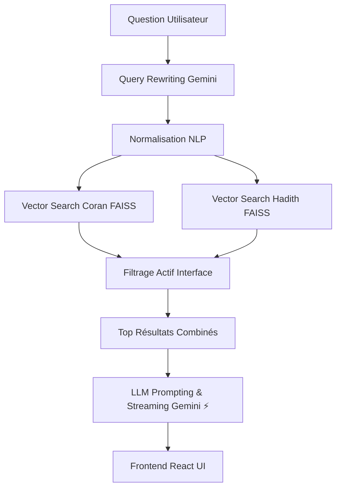

# 📖 IA Coran — Assistant Coranique et Prophétique Intelligent

> Moteur de recherche sémantique et assistant RAG (Retrieval-Augmented Generation) basé sur le Saint Coran et les Hadiths authentiques (Sahih al-Bukhari). Posez vos questions en langage naturel et recevez des réponses sourcées, précises et sans hallucination.

---

## ✨ Fonctionnalités Principales

| Fonctionnalité | Description |
|----------------|-------------|
| **Recherche Hybride Sémantique** | Trouve des versets coraniques et des ahadith par sens via l'IA |
| **Filtres de Sources** | Recherche au choix : `Coran uniquement`, `Hadith uniquement` ou `Les deux` |
| **Assistant IA (RAG)** | Répond aux questions complexes en citant les textes avec extrême précision |
| **Streaming temps réel** | Réponse affichée token par token avec curseur clignotant |
| **Anti-hallucination** | L'IA ne répond que si la réponse est présente dans les textes fondateurs |
| **Normalisation NLP Avancée**| Gestion des accents, harakat arabes et variantes orthographiques |
| **Comptes et Abonnements** | Système d'authentification utilisateur et de limitations quotidiennes |
| **Multi-conversations** | Historique persistant des conversations avec barre latérale style ChatGPT |
| **Thème Clair / Sombre** | Basculement automatique et manuel du mode sombre (persistant) |
| **Interface Premium** | Client React + Tailwind CSS ultramoderne copiant l'UX millimétrée de ChatGPT |

---

## 🏗️ Architecture du Projet

```text
iacoran/
├── core/                          # Configuration principale Django
│   ├── settings.py                # Variables d'environnement, config centralisée
│   └── urls.py                    # Routage principal API
│
├── quran_api/                     # Application Django (Logique Serveur)
│   ├── views.py                   # Endpoints REST (Auth, Search, Ask, Streaming limités)
│   ├── models.py                  # Modèles BDD (UserProfile, SubscriptionPlan)
│   ├── serializers.py             # DRF Serializers
│   └── services/                  # Couche logique métier
│       ├── vector_service.py      # Recherche vectorielle multi-sources (FAISS Coran + Hadith)
│       ├── llm_service.py         # Gemini LLM + Query Rewriting + Streaming RAG
│       └── text_utils.py          # Normalisation NLP FR/AR
│
├── frontend/                      # Interface Utilisateur React
│   ├── src/
│   │   ├── main.tsx               # Entry point
│   │   ├── App.tsx                # App root + gestion Auth
│   │   ├── lib/api.ts             # Client d'API (fetch standard + NDJSON streaming)
│   │   ├── hooks/                 # Hooks de logique (useChat, useAudioSettings)
│   │   └── components/            # Composants UI
│   │       ├── ChatLayout.tsx     # Structure principale
│   │       ├── Sidebar.tsx        # Barre latérale (Historique & Profil)
│   │       ├── MessageBubble.tsx  # Affichage message User / Assistant (Prose/Markdown)
│   │       ├── ChatInput.tsx      # Champ de saisie multi-lignes + Filtres Coran/Hadith
│   │       ├── LimitModal.tsx     # Modale de dépassement de quota (Style premium)
│   │       └── WelcomeScreen.tsx  # Écran plat de démarrage
│
├── scripts de données/            # ETL pour l'IA
│   ├── fetch_hadith.py            # Scraping/Récupération des Ahadith
│   ├── index_hadith.py            # Transformation des ahadith en vecteurs E5
│   ├── index_quran.py             # Transformation du Coran complet en vecteurs E5
│   └── seed_plans.py              # Script d'initialisation des plans d'abonnement
│
├── [bases de connaissances]       # Fichiers volumineux (générés)
│   ├── quran_complet.json / bukhari_complet.json   # Données textuelles brutes
│   ├── quran_indexed.json / hadith_indexed.json    # Méta-données et embbedings bruts
│   └── quran_faiss.index / hadith_faiss.index      # Index binaires ultra-rapides générés
│
└── requirements.txt               # Dépendances Backend (Python)
```

---

## 🧠 Pipeline RAG Multi-Sources

Le cœur du système repose sur un pipeline de "Retrieval-Augmented Generation" robuste :



### Normalisation
Le module `text_utils.py` garantit qu'aucune subtilité linguistique ne perturbera la recherche.
- `صِيَامُ` → `صيام`
- `Jeûne` → `jeune`

---

## 🛠️ Stack Technique

### Backend (Python/Django)
- **Django 5+** + Django REST Framework (API et système d'authentification)
- **FAISS (CPU/GPU)** — Recherche par distance L2 dans l'espace vectoriel dense
- **SentenceTransformers** — Modèle d'embedding `intfloat/multilingual-e5-base`
- **Google Gemini 1.5 Flash** — LLM de haut vol assurant rapidité et fidélité de restitution
- **SQLite** — Base de données utilisateur/usage

### Frontend (Modern React)
- **React 19** / **TypeScript**
- **Vite 6** avec hot-reload & Proxy API
- **Tailwind CSS 3** (Charte méticuleuse empruntant au nouveau design web de ChatGPT)
- **NDJSON Streaming** persillé manuellement via JS `ReadableStream`
- Support rendu riche Markdown

---

## 📦 Installation & Démarrage Local

### Pré-requis
- **Python 3.11+**
- **Node.js 18+**
- Une **[Clé API Google Gemini](https://aistudio.google.com/apikey)**

### Étape 1 — Environnement & Backend

```powershell
# 1. Cloner
git clone <repo-url> iacoran
cd iacoran

# 2. Venv & Dépendances
python -m venv venv
.\venv\Scripts\activate   # ou source venv/bin/activate (Linux/Mac)
pip install -r requirements.txt

# 3. Environnement
# (Créer un fichier .env contenant GEMINI_API_KEY et DJANGO_SECRET_KEY)
# echo "GEMINI_API_KEY=YOUR_API_KEY" > .env
# echo "DJANGO_SECRET_KEY=dev_secret" >> .env

# 4. Base de Données
python manage.py makemigrations
python manage.py migrate

# 5. Injection de la configuration Initiale
python seed_plans.py
```

### Étape 2 — Génération des Index (Une Fois)

⚠️ Prévoyez 30-45 min pour générer la connaissance de l'IA (en fonction du CPU).

```powershell
# Indexer le Coran (~20 min)
python index_quran.py

# Indexer les Ahadith (Bukhari) (~20 min)
# python fetch_hadith.py (Seulement si vous n'avez pas bukhari_complet.json)
python index_hadith.py
```

### Étape 3 — Lancement Serveurs

**Terminal Backend :**
```powershell
python manage.py runserver
```

**Terminal Frontend :**
```powershell
cd frontend
npm install
npm run dev
```

L'application est servie élégamment sur **[http://localhost:5173](http://localhost:5173)**.

---

## 🔌 API Endpoints Principaux

| Méthode | Route | Description | Auth |
|---|---|---|---|
| POST | `/api/register/` | Création de compte utilisateur | Ouverte |
| POST | `/api/login/` | Obtenir les tokens DRF | Ouverte |
| GET | `/api/user/` | Obtenir statistiques du quota & profil | Requise |
| POST | `/api/ask/stream/` | Poser une question (Streaming RAG) | Requise (Génère une 403 si limite) |
| GET | `/api/search/` | Recherche RAG pure format JSON | Optionnelle |

*Chaque endpoint streaming inclut dans ses payloads la restitution de métriques de limites API sous les attributs `reset_time` sur l'UI.*

---

## 🛡️ Règle d'Architecture & Contribution

1. **Anti-Hallucination :** Le système de prompt injecte strictement un JSON de passages en amont de toute question pour contraindre le LLM au RAG.
2. **Frontend UI :** Les directives CSS sont logées dans `index.css`. TailWind CSS est strict (pas de padding brut s'il existe une classe utilitaire). L'UI doit rester totalement minimale ("Page blanche").
3. **DRF Auth :** Les appels API frontend s'appuient sur l'attachement d'un Headers de `Authorization: Token XXXXXX` à `fetch()`. Le rafraîchissement est automatique s'il manque.

---

## 👤 Auteur

abibou
